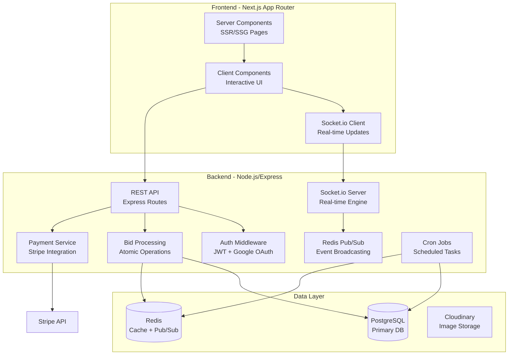

# 🔨 Kế hoạch Triển khai - Ứng dụng Đấu giá Trực tuyến

## Tổng quan

Xây dựng một nền tảng đấu giá trực tuyến thời gian thực với 5 module chính: Auth & Discovery, Wallet & Payment, Real-time Auction Engine, User Dashboard, và Seller Features. Sử dụng Next.js (Frontend) + Node.js/Express (Backend) + Socket.io (Real-time) + Redis + PostgreSQL.

---

## Kiến trúc Tổng thể



---

## Tech Stack Chi tiết

| Layer | Technology | Lý do |
|:---|:---|:---|
| **Frontend** | Next.js 14+ (App Router) | SSR/SSG, SEO tốt, React Server Components |
| **Styling** | Vanilla CSS + CSS Modules | Kiểm soát hoàn toàn, hiệu năng cao |
| **Backend** | Node.js + Express.js | Phù hợp real-time, ecosystem lớn |
| **Real-time** | Socket.io | WebSocket với fallback, room management |
| **Database** | PostgreSQL (Prisma ORM) | ACID transactions cho bid processing |
| **Cache/Pub-Sub** | Redis | Countdown sync, leaderboard, pub/sub |
| **Auth** | NextAuth.js (Auth.js) | Google OAuth + Credentials, JWT sessions |
| **Payment** | Stripe | Pre-authorization, webhooks, refunds |
| **Image Upload** | Cloudinary | CDN, image optimization tự động |
| **Language** | TypeScript | Type safety toàn bộ dự án |

---

## Cấu trúc Thư mục

```
d:\WebDauGia\
├── client/                          # Next.js Frontend
│   ├── public/
│   ├── src/
│   │   ├── app/                     # App Router pages
│   │   │   ├── (auth)/
│   │   │   │   └── login/page.tsx
│   │   │   ├── (main)/
│   │   │   │   ├── layout.tsx       # Main layout với Navbar
│   │   │   │   ├── page.tsx         # Home / Discovery
│   │   │   │   ├── auctions/
│   │   │   │   │   ├── page.tsx     # Auction listing
│   │   │   │   │   └── [id]/
│   │   │   │   │       └── page.tsx # Auction room (real-time)
│   │   │   │   ├── dashboard/
│   │   │   │   │   ├── page.tsx     # Overview
│   │   │   │   │   ├── watchlist/page.tsx
│   │   │   │   │   ├── wallet/page.tsx
│   │   │   │   │   └── profile/page.tsx
│   │   │   │   └── seller/
│   │   │   │       └── create/page.tsx  # Create auction
│   │   │   ├── layout.tsx           # Root layout
│   │   │   └── globals.css
│   │   ├── components/
│   │   │   ├── auction/
│   │   │   │   ├── BidPanel.tsx
│   │   │   │   ├── Leaderboard.tsx
│   │   │   │   └── LiveChat.tsx
│   │   │   ├── layout/
│   │   │   │   ├── BottomNav.tsx
│   │   │   │   ├── Footer.tsx
│   │   │   │   └── Navbar.tsx
│   │   │   └── wallet/
│   │   │       └── DepositModal.tsx
│   │   ├── contexts/
│   │   │   └── AuthContext.tsx      # Global Auth State
│   │   └── lib/
│   │       └── api.ts               # Axios config & wrapper
│   ├── next.config.mjs
│   ├── tsconfig.json
│   └── package.json
│
├── server/                          # Node.js Backend
│   ├── src/
│   │   ├── config/
│   │   │   ├── prisma.ts            # Prisma client
│   │   │   ├── redis.ts             # Redis client
│   │   │   ├── stripe.ts            # Stripe config
│   │   │   └── cloudinary.ts        # Cloudinary config
│   │   ├── middleware/
│   │   │   ├── auth.ts              # JWT verification
│   │   │   └── upload.ts            # Multer file upload
│   │   ├── routes/
│   │   │   ├── auth.routes.ts
│   │   │   ├── auction.routes.ts
│   │   │   ├── bid.routes.ts
│   │   │   ├── wallet.routes.ts
│   │   │   ├── user.routes.ts
│   │   │   └── webhook.routes.ts    # Stripe webhooks
│   │   ├── controllers/
│   │   │   ├── auth.controller.ts
│   │   │   ├── auction.controller.ts
│   │   │   ├── bid.controller.ts
│   │   │   ├── wallet.controller.ts
│   │   │   └── user.controller.ts
│   │   ├── services/
│   │   │   ├── auction.service.ts
│   │   │   ├── bid.service.ts       # Atomic bid processing
│   │   │   ├── wallet.service.ts
│   │   │   └── auctioneer.service.ts # AI Bot logic
│   │   ├── socket/
│   │   │   └── index.ts             # Global Socket.io & Handlers
│   │   ├── server.ts                # HTTP Server wrapper
│   │   └── app.ts                   # Express app entry
│   ├── prisma/
│   │   ├── schema.prisma            # Database schema
│   │   └── seed.ts                  # Seed data
│   ├── tsconfig.json
│   └── package.json
│
└── README.md
```

---

## Database Schema (PostgreSQL + Prisma)

```prisma
// prisma/schema.prisma

generator client {
  provider = "prisma-client-js"
}

datasource db {
  provider = "postgresql"
  url      = env("DATABASE_URL")
}

model User {
  id            String    @id @default(cuid())
  email         String    @unique
  password      String?   // null nếu dùng Google OAuth
  name          String
  avatar        String?
  googleId      String?   @unique
  phone         String?
  address       String?
  role          Role      @default(BIDDER)
  createdAt     DateTime  @default(now())
  updatedAt     DateTime  @updatedAt

  wallet        Wallet?
  auctions      Auction[]       @relation("SellerAuctions")
  bids          Bid[]
  watchlist     Watchlist[]
  reminders     Reminder[]
  notifications Notification[]
}

model Wallet {
  id              String   @id @default(cuid())
  userId          String   @unique
  balance         Decimal  @default(0) @db.Decimal(12, 2)
  frozenBalance   Decimal  @default(0) @db.Decimal(12, 2)
  stripeCustomerId String?
  createdAt       DateTime @default(now())
  updatedAt       DateTime @updatedAt

  user            User     @relation(fields: [userId], references: [id])
  transactions    Transaction[]
  deposits        DepositHold[]
}

model Transaction {
  id          String          @id @default(cuid())
  walletId    String
  amount      Decimal         @db.Decimal(12, 2)
  type        TransactionType
  status      TransactionStatus @default(PENDING)
  description String?
  stripePaymentId String?
  createdAt   DateTime        @default(now())

  wallet      Wallet          @relation(fields: [walletId], references: [id])
}

model DepositHold {
  id                  String       @id @default(cuid())
  walletId            String
  auctionId           String
  amount              Decimal      @db.Decimal(12, 2)
  stripePaymentIntentId String?
  status              DepositStatus @default(HELD)
  createdAt           DateTime     @default(now())
  releasedAt          DateTime?

  wallet              Wallet       @relation(fields: [walletId], references: [id])
  auction             Auction      @relation(fields: [auctionId], references: [id])
}

model Auction {
  id              String        @id @default(cuid())
  title           String
  description     String
  images          String[]      // Array of Cloudinary URLs
  category        Category
  startingPrice   Decimal       @db.Decimal(12, 2)
  currentPrice    Decimal       @db.Decimal(12, 2)
  buyNowPrice     Decimal?      @db.Decimal(12, 2)
  minIncrement    Decimal       @db.Decimal(12, 2)
  depositAmount   Decimal       @db.Decimal(12, 2) // Tiền cọc
  startTime       DateTime
  endTime         DateTime
  status          AuctionStatus @default(SCHEDULED)
  sellerId        String
  winnerId        String?
  createdAt       DateTime      @default(now())
  updatedAt       DateTime      @updatedAt

  seller          User          @relation("SellerAuctions", fields: [sellerId], references: [id])
  bids            Bid[]
  watchlist       Watchlist[]
  reminders       Reminder[]
  deposits        DepositHold[]
  chatMessages    ChatMessage[]
}

model Bid {
  id          String   @id @default(cuid())
  auctionId   String
  userId      String
  amount      Decimal  @db.Decimal(12, 2)
  isWinning   Boolean  @default(false)
  createdAt   DateTime @default(now())

  auction     Auction  @relation(fields: [auctionId], references: [id])
  user        User     @relation(fields: [userId], references: [id])

  @@index([auctionId, amount(sort: Desc)])
}

model ChatMessage {
  id          String      @id @default(cuid())
  auctionId   String
  userId      String?     // null = bot message
  message     String
  isBot       Boolean     @default(false)
  createdAt   DateTime    @default(now())

  auction     Auction     @relation(fields: [auctionId], references: [id])
}

model Watchlist {
  id          String   @id @default(cuid())
  userId      String
  auctionId   String
  createdAt   DateTime @default(now())

  user        User     @relation(fields: [userId], references: [id])
  auction     Auction  @relation(fields: [auctionId], references: [id])

  @@unique([userId, auctionId])
}

model Reminder {
  id          String        @id @default(cuid())
  userId      String
  auctionId   String
  notifyAt    DateTime      // 15 phút trước khi bắt đầu
  status      ReminderStatus @default(PENDING)
  createdAt   DateTime      @default(now())

  user        User          @relation(fields: [userId], references: [id])
  auction     Auction       @relation(fields: [auctionId], references: [id])

  @@unique([userId, auctionId])
}

model Notification {
  id          String   @id @default(cuid())
  userId      String
  title       String
  message     String
  type        NotificationType
  isRead      Boolean  @default(false)
  data        Json?    // metadata (auctionId, bidAmount, etc.)
  createdAt   DateTime @default(now())

  user        User     @relation(fields: [userId], references: [id])
}

// --- Enums ---

enum Role {
  BIDDER
  SELLER
  ADMIN
}

enum Category {
  WATCHES
  ART
  TECHNOLOGY
  JEWELRY
  FASHION
  COLLECTIBLES
  VEHICLES
  REAL_ESTATE
  OTHER
}

enum AuctionStatus {
  SCHEDULED
  ACTIVE
  ENDED
  CANCELLED
}

enum TransactionType {
  DEPOSIT
  WITHDRAWAL
  BID_HOLD
  BID_RELEASE
  PAYMENT
  REFUND
}

enum TransactionStatus {
  PENDING
  COMPLETED
  FAILED
  CANCELLED
}

enum DepositStatus {
  HELD
  RELEASED
  CHARGED
}

enum ReminderStatus {
  PENDING
  SENT
  CANCELLED
}

enum NotificationType {
  BID_OUTBID
  AUCTION_WON
  AUCTION_LOST
  AUCTION_STARTING
  PAYMENT_SUCCESS
  DEPOSIT_RELEASED
  SYSTEM
}
```

---

## API Design

### Auth Routes (`/api/auth`)
| Method | Endpoint | Mô tả |
|:---|:---|:---|
| POST | `/register` | Đăng ký bằng email/password |
| POST | `/login` | Đăng nhập email/password |
| POST | `/google` | Đăng nhập Google OAuth |
| GET | `/me` | Lấy thông tin user hiện tại |
| POST | `/logout` | Đăng xuất |

### Auction Routes (`/api/auctions`)
| Method | Endpoint | Mô tả |
|:---|:---|:---|
| GET | `/` | Danh sách auctions (filter, sort, pagination) |
| GET | `/:id` | Chi tiết 1 auction |
| POST | `/` | Tạo auction mới (Seller) |
| PUT | `/:id` | Cập nhật auction (Seller) |
| POST | `/:id/join` | Tham gia phòng đấu giá (requires deposit) |
| POST | `/:id/remind` | Đặt lịch nhắc nhở |
| POST | `/:id/watchlist` | Thêm vào watchlist |

### Bid Routes (`/api/bids`)
| Method | Endpoint | Mô tả |
|:---|:---|:---|
| POST | `/` | Đặt bid mới (atomic operation) |
| GET | `/auction/:id` | Lịch sử bid của 1 auction |
| GET | `/my-bids` | Lịch sử bid cá nhân |

### Wallet Routes (`/api/wallet`)
| Method | Endpoint | Mô tả |
|:---|:---|:---|
| GET | `/` | Xem thông tin ví |
| POST | `/deposit` | Nạp tiền (Stripe) |
| POST | `/withdraw` | Rút tiền |
| GET | `/transactions` | Lịch sử giao dịch |

### Webhook Routes (`/api/webhooks`)
| Method | Endpoint | Mô tả |
|:---|:---|:---|
| POST | `/stripe` | Stripe webhook handler |

---

## Real-time Engine (Socket.io Events)

### Client → Server Events
| Event | Payload | Mô tả |
|:---|:---|:---|
| `join_auction` | `{ auctionId }` | Tham gia phòng đấu giá |
| `leave_auction` | `{ auctionId }` | Rời phòng |
| `place_bid` | `{ auctionId, amount }` | Đặt giá |
| `send_message` | `{ auctionId, message }` | Gửi tin nhắn chat |

### Server → Client Events
| Event | Payload | Mô tả |
|:---|:---|:---|
| `bid_update` | `{ bid, currentPrice, leaderboard }` | Cập nhật giá mới |
| `outbid_alert` | `{ auctionId, newAmount, bidder }` | Thông báo bị vượt giá |
| `countdown_sync` | `{ auctionId, remainingMs, serverTime }` | Đồng bộ countdown |
| `auction_ended` | `{ auctionId, winner, finalPrice }` | Phiên kết thúc |
| `new_message` | `{ message, user, isBot }` | Tin nhắn mới |
| `participant_count` | `{ count }` | Số người trong phòng |
| `leaderboard_update` | `{ top5 }` | Cập nhật bảng xếp hạng |

---

## Xử lý Tranh chấp Bid (Concurrency Handling)

Sử dụng **Redis Lua Script** để đảm bảo atomic:

```lua
-- bid_atomic.lua
local auction_key = KEYS[1]
local current_price = tonumber(redis.call('GET', auction_key .. ':current_price'))
local min_increment = tonumber(redis.call('GET', auction_key .. ':min_increment'))
local bid_amount = tonumber(ARGV[1])
local user_id = ARGV[2]
local timestamp = ARGV[3]

-- Kiểm tra bid hợp lệ
if bid_amount < current_price + min_increment then
    return cjson.encode({success = false, error = "BID_TOO_LOW"})
end

-- Cập nhật atomic
redis.call('SET', auction_key .. ':current_price', bid_amount)
redis.call('SET', auction_key .. ':leading_bidder', user_id)
redis.call('ZADD', auction_key .. ':leaderboard', bid_amount, user_id)

-- Publish event
redis.call('PUBLISH', 'bid_channel', cjson.encode({
    auctionId = KEYS[1],
    amount = bid_amount,
    userId = user_id,
    timestamp = timestamp
}))

return cjson.encode({success = true, newPrice = bid_amount})
```

---

## Countdown Đồng bộ

```
Server (Redis) lưu: auction:123:end_time = 1714500000000 (Unix ms)
                     
Mỗi 1 giây, server broadcast:
  {
    serverTime: Date.now(),      // Thời gian server
    endTime: 1714500000000,      // Thời gian kết thúc
    remainingMs: endTime - now   // Thời gian còn lại
  }
  
Client tính: remaining = serverRemaining - (Date.now() - receivedAt)
             → Bù trừ latency mạng
```

---

## Phân Pha Triển Khai

### 🔵 Phase 1: Foundation (Tuần 1-2)
- [x] Setup project structure (Next.js + Node.js + TypeScript)
- [ ] Configure ESLint, Prettier
- [ ] Setup PostgreSQL + Prisma schema + migrations
- [ ] Setup Redis connection
- [ ] Implement design system (CSS variables, animations, components)
- [ ] Build reusable UI components (Button, Card, Input, Modal, Badge, Toast)
- [ ] Create layout components (Navbar, Sidebar, Footer)

### 🟢 Phase 2: Auth & Discovery (Tuần 2-3)
- [ ] Implement Auth (Email/Password + Google OAuth via NextAuth.js)
- [ ] JWT middleware + protected routes
- [ ] Home page với hero section
- [ ] Auction listing page (filter by category, sort by status)
- [ ] Auction detail page (static info)
- [ ] Reminder system (cron job + notification)

### 🟡 Phase 3: Wallet & Payment (Tuần 3-4)
- [ ] Stripe integration setup
- [ ] Wallet model + CRUD
- [ ] Deposit hold (Pre-authorization)
- [ ] Auto-release on auction end
- [ ] Final checkout flow
- [ ] Stripe webhook handler

### 🔴 Phase 4: Real-time Engine (Tuần 4-6) — **Core Feature**
- [ ] Socket.io server setup + room management
- [ ] Live bidding with atomic Redis operations
- [ ] Synced countdown timer
- [ ] Outbid alert (screen flash + vibration)
- [ ] Live leaderboard (Top 5)
- [ ] Auctioneer Bot (auto-comment logic)
- [ ] Chat system trong phòng đấu giá
- [ ] Anti-sniping (auto-extend thời gian)

### 🟣 Phase 5: Dashboard & Seller (Tuần 6-7)
- [ ] User dashboard (overview, stats)
- [ ] Watchlist management
- [ ] Win/Loss history + invoice
- [ ] Profile management
- [ ] Seller: Create auction form (Cloudinary upload)
- [ ] Seller: Price configuration
- [ ] Seller: Schedule auction

### ⚪ Phase 6: Polish & Deploy (Tuần 7-8)
- [ ] Responsive design (mobile, tablet)
- [ ] Dark mode
- [ ] Performance optimization (lazy loading, image optimization)
- [ ] Error handling & loading states
- [ ] SEO meta tags
- [ ] Testing (unit + integration)
- [ ] Deployment (Vercel + Railway/Render)

---

## User Review Required

> [!WARNING]
> Qua quá trình rà soát toàn bộ mã nguồn, tôi đã phát hiện một số **lỗ hổng bảo mật và logic** cần được khắc phục trước khi hệ thống thực sự hoàn hảo. Dưới đây là danh sách những thứ còn thiếu và giải pháp:

### 1. Thiếu Middleware Bảo vệ Route (Frontend)
- **Tình trạng**: Hiện tại ai cũng có thể gõ URL `/dashboard/seller/create` và truy cập vào giao diện mà không bị đá văng ra ngoài, dù API sẽ báo lỗi 401.
- **Đề xuất**: Tạo file `client/src/middleware.ts` để chặn toàn bộ các URL bắt đầu bằng `/dashboard` nếu không có token hợp lệ, tự động redirect về `/login`.

### 2. Logic Kích hoạt Phiên đấu giá (Backend)
- **Tình trạng**: Hệ thống hiện chỉ tự động **đóng** các phiên `ACTIVE` khi hết giờ, nhưng lại **quên mất** logic tự động chuyển các phiên từ `SCHEDULED` sang `ACTIVE` khi đến giờ bắt đầu (`startTime`).
- **Đề xuất**: Bổ sung vòng lặp quét các phiên `SCHEDULED` có `startTime <= Date.now()` trong file `socket/index.ts` để tự động mở khóa đấu giá.

### 3. Xử lý lỗi Token hết hạn (Frontend)
- **Tình trạng**: File `api.ts` có chặn lỗi 401 (Unauthorized) nhưng chỉ mới xóa token cũ chứ chưa điều hướng người dùng quay lại trang đăng nhập.
- **Đề xuất**: Thêm dòng `window.location.href = '/login'` vào interceptor của Axios để buộc người dùng đăng nhập lại ngay lập tức.

### 4. Xử lý lỗi 404 cho Trang Chi tiết Đấu giá (Frontend)
- **Tình trạng**: Nếu người dùng nhập sai ID phiên đấu giá, trang `[id]/page.tsx` sẽ bị vỡ layout hoặc báo lỗi trắng trang.
- **Đề xuất**: Bắt lỗi 404 từ API và hiển thị giao diện "Phiên đấu giá không tồn tại" tuyệt đẹp kèm nút quay về trang chủ.

## Open Questions

> [!IMPORTANT]
> 1. Bạn có đồng ý với các phương án khắc phục lỗi này không? 
> 2. Bạn có muốn tôi tiến hành fix toàn bộ 4 lỗi này ngay lập tức không?

## Verification Plan

### Manual Verification
- Cố tình truy cập `/dashboard` khi chưa đăng nhập -> Kì vọng: Bị đá về `/login`.
- Đổi token trong LocalStorage thành token ảo -> Kì vọng: Tự động bị văng ra `/login` khi gọi API.
- Tạo một phiên đấu giá Scheduled sau 1 phút -> Kì vọng: Đúng 1 phút sau nó tự động chuyển sang LIVE (ACTIVE) và cho phép đặt giá.
- Truy cập `/auctions/fake-id` -> Kì vọng: Hiện thông báo 404 đẹp mắt.
